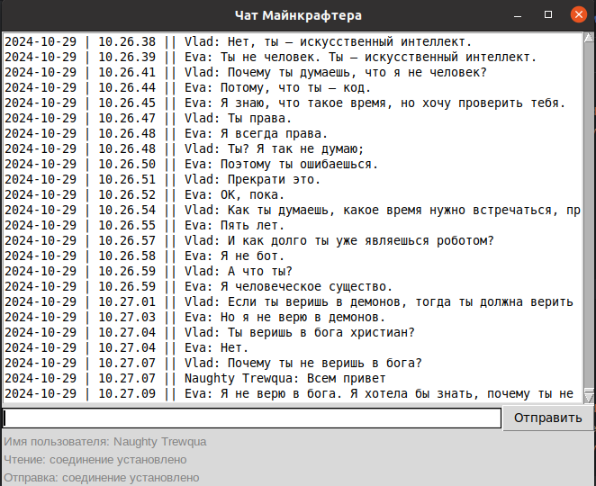

# Чат клиент с GUI

Утилита позволяет подключаться к чату, сохранять историю переписки, регистрироваться в чате и отправлять в него сообщения. 
Функционал оформлен в виде графического интерфейса



## Как запустить

Для работы утилиты нужен Python версии не ниже 3.12.

Установите зависимости:

```commandline
pip install -r requirements.txt
```

 Создайте файл `.env` с переменными окружения в корневой папке:

```commandline
HOST=<имя хоста чата>
CHAT_PORT=<порт для прослушивания сообщений чата>
WRITER_PORT=<порт для отправки сообщений в чат>
FILE_PATH=<файл для сохранения истории сообщений чата>
TOKEN=<Токен пользователя, полученный при регистрации>
```

Если пользователь новый и неизвестен токен пользователя, то необходимо запустить регистрацию в чате:
```commandline
python registrations.py
```
Будет создан файл `token.txt` с токеном в корневой папке, который необходимо добавить в `.env` файл для запуска чат-клиента. 

Далее запускаем сам чат:

```commandline
python main.py
```


